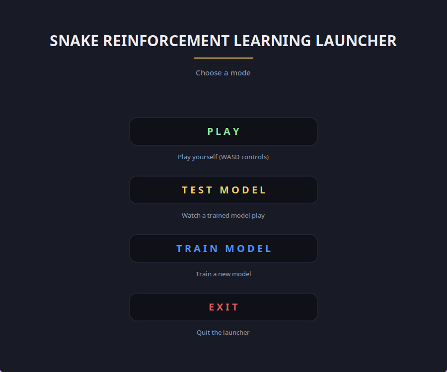
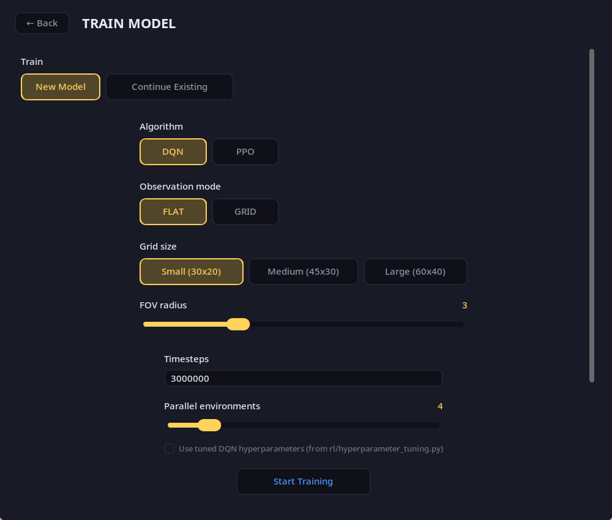
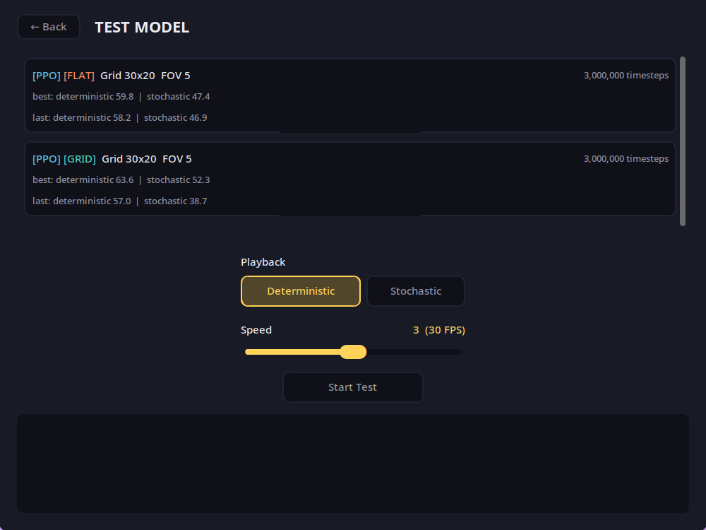

# Deep Reinforcement Learning Snake Game

[](https://www.python.org/)
[](https://gymnasium.farama.org/)
[](https://stable-baselines3.readthedocs.io/)
[](https://optuna.org/)
[](https://github.com/TomSchimansky/CustomTkinter)

An advanced Reinforcement Learning pipeline featuring a custom-built Game Engine, a Gymnasium-standardized environment, automated hyperparameter optimization, and a graphical desktop launcher to play, watch, and train from.

---

## Launcher

Everything is driven from a single dark-mode desktop app (`python src/main.py`) — no editing scripts or calling functions by hand. Four modes, each a full screen: **Play** yourself, **Test Model** to watch a trained agent, **Train Model** to start or continue a training run, and **Exit**.

<p align="center">
  
</p>

**Train Model** is a single scrollable form — algorithm, observation mode, grid size, FOV radius, timesteps, parallel environments, and the live training log all in one screen, so you never lose sight of the log while configuring a run. Continuing an existing run shows the same log, plus an independently-scrollable list of saved checkpoints with a "Resume from" choice to its right.

<p align="center">
  
</p>

**Test Model** lists every checkpoint found under `Training/SAVED_MODELS/`, color-coded by algorithm (PPO/DQN) and observation mode (FLAT/GRID) so a long list stays easy to scan, sorted by algorithm → observation mode → grid size → FOV radius. Each card shows its deterministic/stochastic evaluation scores at a glance.

<p align="center">
  
</p>

---

## Project Architecture & Engineering

The project is a set of small, focused packages:

### `game/` — Core Engine & Environment
* **`snake_game.py`** — The Snake game itself, built from scratch on Pygame. Object-oriented (`SnakeGame`, `SnakePart`, `Apple`, `Direction`), fully decoupled from the AI so it runs identically for human play, headless training, and visual playback.
* **`environment.py`** — A custom Gymnasium (`gym.Env`) wrapper around the game.
* **`game_over.py`** — The shared death-animation and game-over overlay used by both human play and model playback.

### `rl/` — Training & Playback Pipeline
* **`training.py`** — `train_model()`: trains DQN or PPO with `SubprocVecEnv`-parallelized environments, periodic evaluation, best-model tracking, and graceful cancel/discard support.
* **`playback.py`** — `play_game()` (human play) and `test_model()` (watch a trained agent), both pygame windows.
* **`hyperparameter_tuning.py`** — Optuna-driven DQN hyperparameter search.
* **`feature_extractors.py`**, **`callbacks.py`**, **`paths.py`**, **`check_models.py`** — the CNN feature extractor for GRID mode, training callbacks, the checkpoint directory layout, and a manual "does every saved model still load?" sanity check.

### `ui/` — Desktop Launcher
A CustomTkinter app (`ui/app.py`) with one screen per mode under `ui/screens/`, sharing a small theme/widget toolkit (`ui/theme.py`, `ui/widgets.py`) and the checkpoint-discovery logic (`ui/models.py`).

### `main.py`
The entry point: `python main.py` launches the UI. Nothing else lives here — kept intentionally thin to avoid an import cycle with `ui`.

---

## Technical Highlights

### The Observation Logic
The agent doesn't see pixels; it perceives a local **Field of View (FOV)** around its head — a $(2n+1) \times (2n+1)$ window — so a trained model generalizes to grid sizes it never trained on. Two observation layouts are supported, selectable per training run:
* **FLAT** — a `MultiDiscrete` vector of the FOV's cell contents (`0`=empty, `1`=body, `2`=apple, `3`=wall) plus the apple's direction, for a standard `MlpPolicy`.
* **GRID** — the same FOV as a one-hot `(4, H, W)` tensor plus the apple's direction, fed through a small purpose-built CNN (`SnakeCombinedExtractor`) via a `MultiInputPolicy` — SB3's default CNN assumes much larger image-like inputs, so a small custom extractor was needed for a 7×7–17×17 FOV window.

Press **`f`** while watching a model play to toggle a debug overlay: the FOV window it's currently looking at, and an arrow for the apple-direction feature.

### Complex Reward Shaping
* **Positive:** reaching the apple.
* **Negative:** dying, scaled by snake length (a late-game mistake costs more than an early one).
* **Loop prevention:** a small penalty for excessive steps without progress, to discourage infinite circling.

### Automated Logging & Callbacks
`rl/callbacks.py`'s `DeathLogger` tracks more than reward during training:
* **Death Analysis:** collision vs. `MaxSteps` timeout, reported periodically.
* **Model Comparison:** the "best" checkpoint is only overwritten if a new evaluation actually beats it.

### Error Checking
`rl/check_models.py` (`python -m rl.check_models`) loads every checkpoint the launcher would list, and reports which ones actually load — catching a broken/incompatible checkpoint (e.g. a stale module reference from a refactor) before it surfaces as a cryptic error mid-session in the UI.

---

## Installation & Usage

### 1. Prerequisites
Python 3.13+. The project uses [`uv`](https://docs.astral.sh/uv/) for dependency management (a `uv.lock` is checked in); plain `pip` works too.

### 2. Install Dependencies

```bash
uv sync
```

or, without `uv`:

```bash
pip install pygame numpy gymnasium stable-baselines3 optuna customtkinter
```

### 3. Run It

```bash
python src/main.py
```

Run this from the repo root (not from inside `src/`) — `Training/` (and `Training/SAVED_MODELS/`) is resolved relative to the current working directory and is created automatically as needed; nothing has to exist beforehand.

This opens the launcher — pick **Play**, **Test Model**, or **Train Model** from there.

Everything is also directly importable for scripting, e.g.:

```python
from rl.training import train_model
from rl.playback import play_game, test_model

train_model(model_name="DQN", grid_width=30, grid_height=20, timesteps=3_000_000)
test_model(model_name="DQN", grid_width=30, grid_height=20, snake_fov_radius=3)
```

---

## Project Structure

```text
├── src/
│   ├── main.py                   # Entry point: launches the UI
│   ├── game/
│   │   ├── snake_game.py         # Pygame-based game engine
│   │   ├── environment.py        # Gymnasium environment wrapper
│   │   └── game_over.py          # Shared death animation + game-over overlay
│   ├── rl/
│   │   ├── training.py           # train_model()
│   │   ├── playback.py           # play_game(), test_model()
│   │   ├── hyperparameter_tuning.py  # Optuna DQN search
│   │   ├── feature_extractors.py # CNN extractor for GRID observation mode
│   │   ├── callbacks.py          # DeathLogger training callback
│   │   ├── paths.py              # Checkpoint directory layout + grid presets
│   │   └── check_models.py       # Manual "do all saved models load?" check
│   └── ui/
│       ├── app.py                # App root window + navigation
│       ├── theme.py, widgets.py  # Shared color palette + widget factories
│       ├── models.py             # Checkpoint discovery for the UI
│       └── screens/              # home, play, test_model, train_model, base
├── tests/                        # pytest suite for game/ and rl/
└── Training/
    └── SAVED_MODELS/
        └── {PPO,DQN}/{FLAT,GRID}/GRID_{w}_{h}/FOV_RADIUS_{r}/
            ├── best_model_{steps}.zip
            ├── last_model_{steps}.zip
            └── evaluation.json
```

---

## License

This project is licensed under the MIT License - see the [LICENSE](LICENSE.md) file for details.

---

**Developed by Luis Kahles**

*Focus: Reinforcement Learning, Modular Software Architecture, and AI-Driven Automation.*
